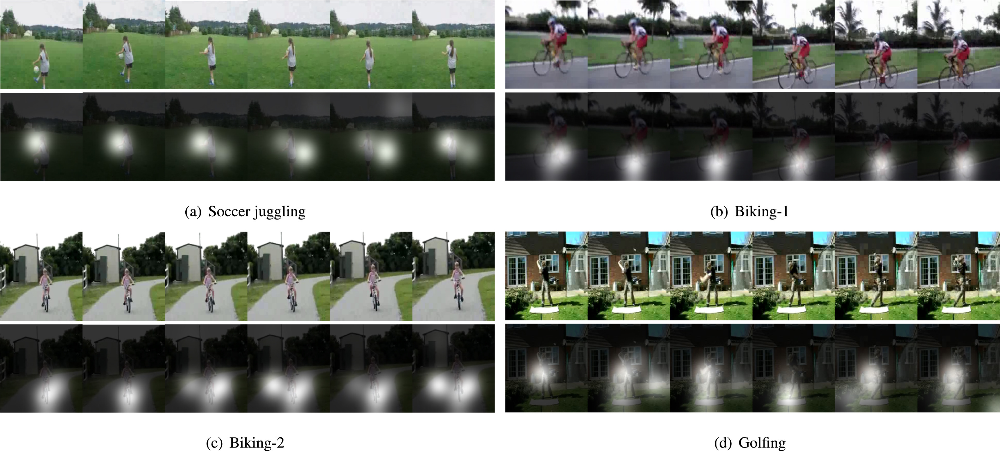

# Action Recognition
##### Attention with structure regularization for action recognition(CVIU 2019)   
Yuhui Quan, Yixin Chen, Ruotao Xu, Hui ji
##### https://doi.org/10.1016/j.cviu.2019.102794  

## Abstract
Recognizing human action in video is an important task with a wide range of applications. Recently, motivated by the findings in human visual perception, there have been numerous attempts on introducing attention mechanisms to action recognition systems. However, it is empirically observed that an implementation of attention mechanism using attention mask of free form often generates ineffective distracted attention regions caused by overfitting, which limits the benefit of attention mechanisms for action recognition. By exploiting block-structured sparsity prior on attention regions, this paper proposed an L_2,1-norm group sparsity regularization for learning structured attention masks. Built upon such a regularized attention module, an attention-based recurrent network is developed for action recognition. The experimental results on two benchmark datasets showed that, the proposed method can noticeably improve the accuracy of attention masks, which results in performance gain in action recognition.

## Network Architecture


## Dependencies
+ Python == 2.7
+ Numpy == 1.16
+ Tensorflow == 0.12
+ opencv-python = 3.4

## Step
#### Data processing:  
Extract features of video frames and save them as tfrecords files
```
python video_to_tfrecords.py
```
Explanation of the parameters
```
- video_path: Directory of video files
- video_file_name: Video names list file for training
- tfrecords_path: Directory for saving tfrecords
- npy_path: Directory for saving npy
```

#### Train:
```
python train.py
```
Explanation of the parameters
```
- dataset: The name of the database
- class_num: Number of action categories
- num_layers: Number of RNN layers
- num_steps: Number of RNN cycles
- hidden_size: Hidden layer size of RNN
- keep_prob: Parameters of dropout layer 
- globle_gamma = Parameters of loss
- globle_lamda = Parameters of loss
- lr_rate: Learning rate
- max_epoch: Training epoches
- batch_size: Batch size
- group_sparse_size: Parameters of group sparsity regularization
- log_txt_dir: Directory for logs 
- model_dir: Directory for models
```

#### Test:
```
python test.py
```
Explanation of the parameters
```
- test_video_num: Number of test videos
- model_name: The name of the model to be loaded
- test_sample_txt: Video names list file for test
```

## Example Results
#### Atention visualization
First line: Continuous frames; Second line: Atention maps corresponding to the action



#### Comparison visualization
Left: Feature maps without regularization; Right: Feature maps with regularization


## Citing
```
@article{quan2019attention,
  title={Attention with structure regularization for action recognition},
  author={Quan, Yuhui and Chen, Yixin and Xu, Ruotao and Ji, Hui},
  journal={Computer Vision and Image Understanding},
  volume={187},
  pages={102794},
  year={2019},
  publisher={Elsevier}
}
```